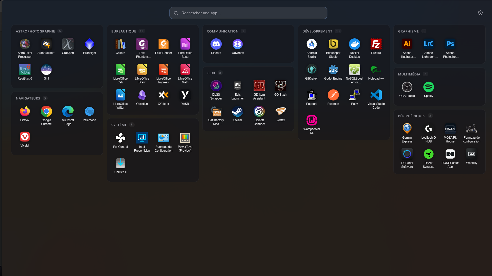
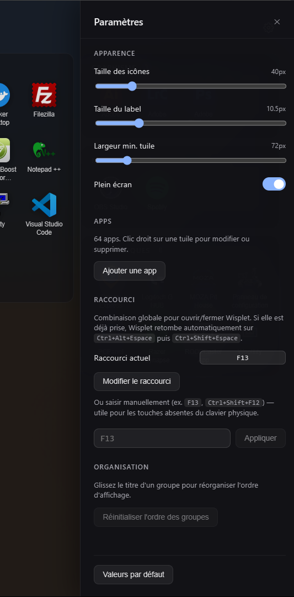
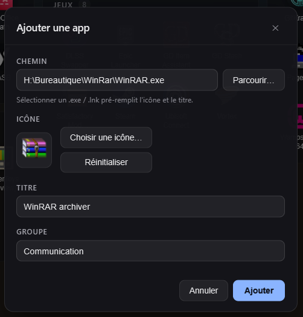

<p align="center">
  
</p>

<h1 align="center">Wisplet</h1>

<p align="center">
  Keyboard-first app launcher overlay for Windows 11 — global hotkey toggle,
  grouped sections, Mica blur. Built with Tauri 2 + Svelte 5.
</p>

Wisplet is a Launchpad-inspired app launcher that overlays the desktop on a global hotkey. Search, browse grouped sections, launch — then it gets out of your way.

<p align="center">
  
</p>

## Features

- **Global hotkey toggle** (`Alt+Space` by default — same as PowerToys Run / Flow Launcher; rebindable in settings is on the roadmap).
- **Fast fuzzy search** across all your apps, with the input focused on every open.
- **Sections** — apps are grouped (Dev, Media, Tools, …) into a masonry of cards.
- **Mica blur** background (native Windows 11 windowEffect via Tauri).
- **Zero white flash** — Win32 layered-window alpha trick lets the WebView paint before the window is ever visible.
- **Optional cover-screen mode** — the window resizes to fully cover the current monitor (without using Win11's real fullscreen, which would eat the global hotkey).
- **System tray** with show / quit menu, single-instance lifecycle.
- **Persistent settings** (icon / label size, tile width, cover-screen toggle) in `localStorage`.

## Screenshots

|  |  |
|:--:|:--:|
| Settings drawer — appearance, hotkey, app management | Adding an app — native file picker, auto-filled icon & title |

## Requirements

- Windows 11 (Mica requires Win11; Win10 will fall back to no effect).
- WebView2 runtime (preinstalled on modern Windows).
- For LWin tap binding: [AutoHotkey v2](https://www.autohotkey.com/).

## Installation

Grab the latest `Wisplet_<version>_x64-setup.exe` (NSIS) or `.msi` from the [Releases](https://github.com/greyfox-be/wisplet/releases) page and run it.

## Configuration

Wisplet reads its app list from:

```
%USERPROFILE%\.config\yasb\launchpad\apps.json
```

Format:

```json
[
  {
    "id": 1,
    "title": "Visual Studio Code",
    "path": "C:\\Users\\you\\AppData\\Local\\Programs\\Microsoft VS Code\\Code.exe",
    "icon": "C:\\path\\to\\icon.png",
    "group": "Dev",
    "type": "exe"
  }
]
```

> The path is reused from [yasb-launchpad](https://github.com/amnweb/yasb) for compatibility. A native config UI is on the roadmap.

## Hotkey

The default hotkey is `Alt+Space`, registered as a global shortcut via [`tauri-plugin-global-shortcut`](https://v2.tauri.app/plugin/global-shortcut/). This matches the conventional launcher hotkey on Windows (PowerToys Run, Flow Launcher).

> **Conflict note**: if you already run PowerToys Run or Flow Launcher with the same default, only one will receive the hotkey. Rebind one of them — in-app rebinding for Wisplet is on the roadmap.

### Optional: bind a single `LWin` tap

If you want a single Windows-key tap to open Wisplet (instead of the Start menu), use AutoHotkey v2:

```ahk
#Requires AutoHotkey v2.0
#SingleInstance Force

LWin:: {
    Send "{Blind}{vk07}"     ; phantom key — suppresses Start menu on keyup
    KeyWait "LWin"
    if (A_PriorKey != "LWin" && A_PriorKey != "vk07")
        return               ; let Win+X combos pass through
    Send "!{Space}"          ; trigger Wisplet
}
```

Save as `launchpad-bind.ahk` and run it (e.g. from `shell:startup`).

## Development

```powershell
# install deps
pnpm install

# dev (hot reload, WebView devtools, full Rust rebuild on backend changes)
pnpm tauri dev

# production build (NSIS + MSI in src-tauri/target/release/bundle/)
pnpm tauri build
```

### Stack

- **Frontend**: Svelte 5 (runes) + SvelteKit + Vite 6 + TypeScript
- **Backend**: Tauri 2 (Rust 1.95+)
- **Build**: pnpm 10.33 (managed via corepack)
- **Toolchain**: Node 22.19+, Rust 1.95+

### Project layout

```
src/                       # Svelte UI
├── app.html               # HTML shell (transparent background)
└── routes/+page.svelte    # Full UI: search, settings drawer, anims

src-tauri/
├── src/lib.rs             # Tauri commands, tray, global shortcut, window geometry
├── tauri.conf.json        # Window config (Mica, transparent, frameless)
├── capabilities/          # Tauri 2 permissions
└── Cargo.toml
```

## Roadmap

- [ ] **Rebindable hotkey from the settings drawer** (priority — needed to resolve conflicts with PowerToys Run / Flow Launcher)
- [ ] In-app accent color picker
- [ ] In-app editor for the app list (no more hand-editing `apps.json`)
- [ ] Skins system: drop `.css` files in `~/.config/wisplet/skins/`, hot-reload
- [ ] Plugin system: custom app sources, search providers, lifecycle hooks

## Known limitations

- **Acrylic + WebView2** has hover redraw glitches upstream — only Mica is exposed.
- **Win11 real fullscreen** blocks global hotkeys. Wisplet uses a "cover-screen" approximation (window sized to the monitor) instead.

## Contributing

Issues and PRs welcome. Keep changes focused and discuss larger features in an issue first.

## License

[MIT](LICENSE) — Copyright (c) 2026 Greyfox Consulting
